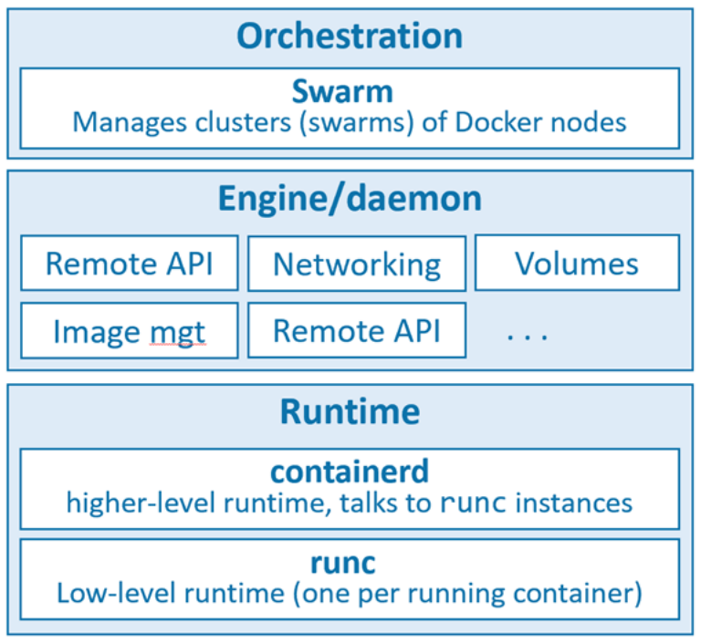

# Docker overview

Khi nói về docker, ta có thể đề cập đến một trong những điều sau: 

1. Docker, Inc. the company

2. Docker the technology

Docker được phát triển bởi `Docker, Inc` vào năm 2013, một công ty công nghệ có trụ sở tại Mỹ. Nó là 1 phần mềm chạy trên Linux hoặc Windows, cho phép bạn dựng, kiểm thử và triển khai ứng dụng 1 cách nhanh chóng. Docker đóng gói phần mềm vào các đơn vị tiêu chuẩn hóa được gọi là container. Bằng cách sử dụng docker, bạn có thể nhanh chóng triển khai và thay đổi quy mô ứng dụng vào bất kỳ môi trường nào và biết chắc rằng mã của bạn sẽ chạy dk. 

`Docker` được đặt tên xuất phát từ cách diễn đạt `dock worker`. 

### 1. Docker technology

Khi người ta nói về `Docker`, phần lớn là nói về công nghệ docker. Tuy nhiên, có ít nhất 3 điều cần lưu ý với công nghệ docker:

1. The runtime
2. The daemon
3. The orchestrator

**Runtime** 

runtime hoạt động ở mức thấp nhất và chịu trách nhiệm khởi động, dừng các container. Docker triển khai kiến trúc runtime theo tầng với các runtime cấp cao và cấp thấp hoạt động cùng nhau.

runtime ở mức thấp được gọi là `rnc` và là cách triển khai tham chiếu của Open Containers Initiative (OCI).  Công việc của nó là giao tiếp với hệ điều hành bên dưới và khởi động, dừng các container. Mọi container đang chạy trên 1 nút docker có 1 phiên bản `runc` quản lý nó. 

runtime ở mức cao gọi là `containerd` làm được nhiều hơn `runc`. Nó quản lý toàn bộ vòng đời của 1 containerd, bao gồm: pulling images, creating network interface, và quản lý các phiên bản runc cấp thấp hơn. 

**daemon**

Docker deamon (dockerd) nằm phía trên containerd và thực hiện các tác vị cấp cao hơn như: managing images, managing volumes, managing networks, exposing the docker remote API

**Orchestration**

Docker cũng có hỗ trợ riêng để quản lý các cluster, node đang chạy docker. Các cluster này gọi là `swarms`. Docker Swarm dễ sử dụng và nhiều công ty đang sử dụng nó trong product. Tuy nhiên mọi người chọn sử dụng kubernets thay vì docker swarm. 

### 2. Open Container Initiative (OCI)

