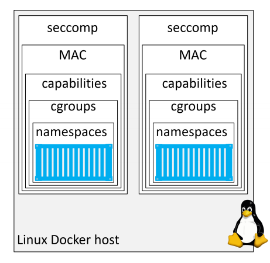

# Security in Docker

## 1. Security in Docker - The TLDR

Docker cung cấp rất nhiều lớp bảo mật. Docker trong linux tận dụng hầu hết Linux security và workload isolation technologies. Những thứ này bao gồm: `namespaces`, `control groups (cgroups)`, `capabilities`, `mandatory access control (MAC) system` và `seccomp`. 

## 2. Security in Docker - The deep dive

Ta biết rằng, bảo mật là quan trọng, nhưng nó có thể phức tạp. Khi docker quyết định đưa bảo mật vào nền tảng của họ, thì họ đã quyết định làm cho nó trở nên đơn giản và dễ dàng. Họ biết rằng nếu bảo mật khó định cấu hình, mọi người sẽ không sử dụng nó. Do đó, hầu hết các công nghệ bảo mật được cung cấp bởi nền tảng docker đều dễ sử dụng. 

### 2.1. Linux security technologies

Tất cả các nền tảng container tốt đều sử dụng `namespaces` và `cgroups` để xây dựng container. 

#### 2.1.1. Namespaces

namespaces nằm ở trung tâm của các containers. Họ chia nhỏ hệ điều hành(OS) để nó trông như nhiều hệ điều hành biệt lập. Điều này cho phép ta làm những việc tuyệt vời như chạy nhiều máy chủ web trên cùng 1 hệ điều hành  mà không bị conflicts port. 

- Namespaces: cho phép bạn chạy nhiều web server, mỗi server trên cổng 443, trên 1 hệ điều hành duy nhất. Để làm điều này, chỉ cần chạy từng ứng dụng máy chủ web bên trong network namespaces của riêng nó. Nó hoạt động vì mỗi network namespaces có địa chỉ ip riêng và đầy đủ các port.


Docker trên linux đang sử dụng các kernel namespaces sau: 

- Process ID (pid)
- Network (net)
- Filesystem/mount (mnt)
- Inter-process Communication (ipc)
- User (user)
- UTS (uts)

Cách docker sử dụng từng namespaces: 

- `process ID namespace`: Docker sử dụng `pid` namespaces để cô lập process trees cho mỗi container. Điều này có nghĩa là 1 container khoogn thể nhìn thấy hoặc truy cập vào các process trees của các container khác. 

- `Network namespace`: Docker sử dụng `net` namespaces để cung cấp cho mỗi containe 1 network stack riêng biệt. Stack này bao gồm: `interfaces`, `IP addresses`, `port ranges`, và `routing tables`. 

- `Mount namespaces`: Mỗi container có được hệ thống tập tin root (/) riêng biệt. Điều này có nghĩa là mỗi container có thể có riêng `/etc`, `/var`, `/dev` và các cấu trúc hệ thống filesystem riêng biệt. 

- `Inter-process Communication namespace`: Docker sử dụng `ipc` namespaces để chia sẻ memory trong 1 container. 

- `User namespace`: Docker cho phép bạn sử dụng `user` namespaces để map user bên trong container 

- `UTS namespace`: Docker sử dụng `uts` namespace để cung cấp cho mỗi contauner với hostname của riêng mình.
 

=> 1 container là 1 bộ sưu tập các namspace được đóng gói và sẵn sàng để sử dụng. 

#### 2.1.2. Control Groups

Các container được cách ly nhưng đều dùng chung tài nguyên 1 hệ điều hành như RAM, CPU, network bandwidth, disk I/O. Cgroups cho phép thiết lập các giới hạn để không 1 container nào có thể sử dụng hết tài nguyên của docker host. 

#### 2.1.3. Capabilities

Kernel linux có thể chia nhỏ các đặc quyền của user root thành các đơn vị riêng biệt gọi là `capanilities`. 

Ví dụ: Khả năng `CAP_CHOWN` là khả năng cho phéo root sử dụng thực hiện các thay đổi tùy ý đối với UID và GID của tệp. Khả năng `CAP_DAC_OVERRIDE` cho phép người dùng root bỏ qua kiểm tra quyền kerel đối với các hoạt động read, write, excure. Hầu hết các quyền hạn đặc biệt liên quan đến người dùng root được chia thành các khả năng riêng lẻ. 

Việc chia nhỏ các đặc quyền root thành các khả năng chi tiết cho phép bạn: 

- Xóa các khả năng riêng lẻ khỏi user `root`, làm cho nó trở nên kém nguy hiểm đi. 

- Thêm đặc quyền cho user khác root ở mức chi tiết. 

User root của linux là sự kết hợp 1 danh sách dài các khả năng, 1 trong số các khả năng này như: 

- CAP_CHOWN: Cho phép thay đổi quyền sở hữu file
- CAP_NET_BIND_SERVICE: cho phép liên kết các socker đến các network port được đánh số thấp.
- CAP_SETUID: Cho phép nâng cấp đặc quyền của 1 quy trình. 
- CAP_SYS_BOOT: Cho phép khởi động lại hệ thống
.....

Docker hoạt động với các khả năng để bạn chạy container root nhưng thoát ra các khả năng không cần thiết. Docker cũng áp đặt các hạn chế để container không thể thêm lại các khả năng đã bị loại bỏ.

#### 2.1.4. Mandatory Access Control systems

Docker hoạt động chính với công nghệ Linux MAC như AppArmor và SELinux.

Tùy thuộc vào bản phân phối linux, Docker áp dụng cấu hình AppArmor mặc định cho tất cả các container mới. 
Docker cũng cho phép bạn khởi động container mà không cần áp dụng các chính sách cũng như cung cấp cho bạn khả năng tùy chỉnh các chính sách đáp ứng các yêu cầu cụ thể. Điều này có thể phức tạp. 

#### 2.1.5. Seccomp

Theo triết lý bảo mật của Docker, tất cả các container mới đều có cấu hình seccomp mặc định được định cấu hình với các giá trị mặc định hợp lý. Điều này cung cấp khả năng bảo mật vừa phải mà không ảnh hưởng đến khả năng tương thích của ứng dụng. 

#### 2.1.6. Final thoughts on the Linux security technologies

Docker hỗ trợ hầu hết các công nghệ bảo mật quan trọng của Linux và cung cấp các giá trị mặc định hợp lý giúp tăng cường bảo mật nhưng không quá hạn chế.




### 2.2. Docker platform security technologies

#### 2.2.1. Security in Swarm Mode

`swam mode` bao gồm nhiều tính năng bảo mật được bật sẵn với các giá trị mặc định hợp lý bao gồm: 

- Cryptographic node IDs
- TLS for mutual authentication
- Secure join tokens
- CA configuration with automatic certificate rotation
- Encrypted cluster store (config DB)
- Encrypted networks

#### 2.2.2. Configure a secure Swarm

##### 2.2.2.1. Looking behind the scenes at Swarm security

Nếu nghi ngờ mã thông báo `join tokens` của bạn bị xâm phạm, bạn có thể thu hồi và tạo mới như sau: 

```
docker swarm join-token --rotate manager
```

##### 2.2.2.2. Configuring some CA settings

Có thể định cấu hình khoảng thời gian luân chuyển certificate cho swarm với `docker swarm update`.

```
root@dockermgr:~# docker swarm update --cert-expiry 720h
Swarm updated.
```

##### 2.2.2.3. The cluster store


