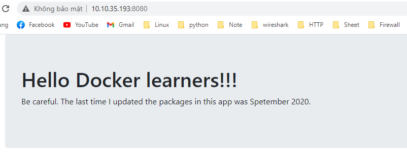

# Cài đặt docker trên Ubuntu 18

### 1. Cài đặt 

- Update hệ thống

```
apt-get update
```

- Install Docker from the official repo

```
apt-get install docker.io
```

- Kiểm tra phiên bản docker: 

```
root@docker:~# docker --version
Docker version 19.03.6, build 369ce74a3c
```

```
root@docker:~# docker info
Client:
 Debug Mode: false

Server:
 Containers: 7
  Running: 3
  Paused: 0
  Stopped: 4
 Images: 10
 Server Version: 19.03.6
 Storage Driver: overlay2
  Backing Filesystem: extfs
  Supports d_type: true
  Native Overlay Diff: true
 Logging Driver: json-file
 Cgroup Driver: cgroupfs
 Plugins:
  Volume: local
  Network: bridge host ipvlan macvlan null overlay
  Log: awslogs fluentd gcplogs gelf journald json-file local logentries splunk syslog
 Swarm: inactive
 Runtimes: runc
 Default Runtime: runc
 Init Binary: docker-init
 containerd version:
 runc version:
 init version:
 Security Options:
  apparmor
  seccomp
   Profile: default
 Kernel Version: 4.15.0-45-generic
 Operating System: Ubuntu 18.04.2 LTS
 OSType: linux
 Architecture: x86_64
 CPUs: 4
 Total Memory: 3.852GiB
 Name: docker
 ID: TN23:KWML:6TBV:ENFE:SXIB:6RT6:UQ6B:FUES:CGP2:TZXQ:USDB:L3BI
 Docker Root Dir: /var/lib/docker
 Debug Mode: false
 Registry: https://index.docker.io/v1/
 Labels:
 Experimental: false
 Insecure Registries:
  127.0.0.0/8
 Live Restore Enabled: false
```

### 2. Một số lệnh docker

**image**

- Sử dụng `images ls` để liệt kê các images:

```
root@docker:~# docker image ls
REPOSITORY          TAG                 IMAGE ID            CREATED             SIZE
test                latest              b677aae8942a        46 minutes ago      93.5MB
ubuntu              latest              4dd97cefde62        7 days ago          72.9MB
alpine              latest              28f6e2705743        3 weeks ago         5.61MB
centos              centos7             8652b9f0cb4c        3 months ago        204MB
```

Đẩy images lên docker ta gọi là `pulling`.

- Pull 1 image ubuntu lên docker:

```
docker image pull ubuntu:latest
```

**Containers**

Khi đã có image, ta sử dụng `docker container run` để khởi động container. 

```
root@docker:~# docker container run -it ubuntu:latest /bin/bash
root@d66a0b235bff:/#
```

1. `docker container run` để khởi động container mới
2. Option `-it` yêu cầu docker làm cho container thành interactive và gắn shell hiện tại vào terminal của container. 


Kiểm tra các process của container thấy có 2 tiến trình đang chạy. 

```
root@d66a0b235bff:/# ps -elf
F S UID        PID  PPID  C PRI  NI ADDR SZ WCHAN  STIME TTY          TIME CMD
4 S root         1     0  0  80   0 -  1028 do_wai 03:08 pts/0    00:00:00 /bin/bash
0 R root         8     1  0  80   0 -  1475 -      03:18 pts/0    00:00:00 ps -elf
```

Để thoát khỏi container về docker và để nó chạy nền, sử dụng lần lượt `ctrl + p`, `ctrl + q`. Sau đó tại docker, kiểm tra các container đang chạy: 

```
root@docker:~# docker container ls
CONTAINER ID        IMAGE               COMMAND             CREATED             STATUS              PORTS                    NAMES
6ebc291bcc64        ubuntu:latest       "/bin/bash"         About an hour ago   Up About an hour                             modest_feynman
```

### 3. Chạy dockerfile

- Clone 1 repo có sẵn trên git

```
git clone https://github.com/nigelpoulton/psweb.git
```

- di chuyển đến thư mục mới clone

```
cd psweb
```

```
root@docker:~/psweb# ls
app.js  circle.yml  Dockerfile  package.json  README.md  test  views
```


- Build container từ docker file : 

```
root@docker:~/psweb# docker image build -t test:latest .
Sending build context to Docker daemon  123.4kB
Step 1/8 : FROM alpine
latest: Pulling from library/alpine
ba3557a56b15: Pull complete
Digest: sha256:a75afd8b57e7f34e4dad8d65e2c7ba2e1975c795ce1ee22fa34f8cf46f96a3be
Status: Downloaded newer image for alpine:latest
 ---> 28f6e2705743
Step 2/8 : LABEL maintainer="nigelpoulton@hotmail.com"
 ---> Running in 9bc1af3188b4
Removing intermediate container 9bc1af3188b4
 ---> 8a2916912da8
Step 3/8 : RUN apk add --update nodejs nodejs-npm
 ---> Running in f3ac5ef955bf
 
 ...
```

Sau đó kiểm tra lại image `test:latest` đã có trên máy: 

```
root@docker:~/psweb# docker image ls
REPOSITORY          TAG                 IMAGE ID            CREATED             SIZE
test                latest              b677aae8942a        11 seconds ago      93.5MB
...
```

- Run container từ image, đặt tên là web và port trên web là 8080: 

```
root@docker:~/psweb# docker container run -d \
> --name web1 \
> --publish 8080:8080 \
> test:latest
c55d7e34a0a1f23d1d8d2dfa7cd311e1a9efec0f430298231cf3b62f273878c0
```

Truy cập web với port 8080 để kiểm tra: 




