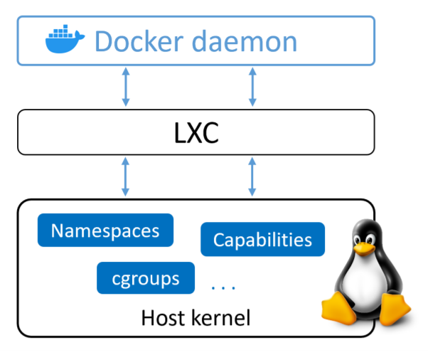
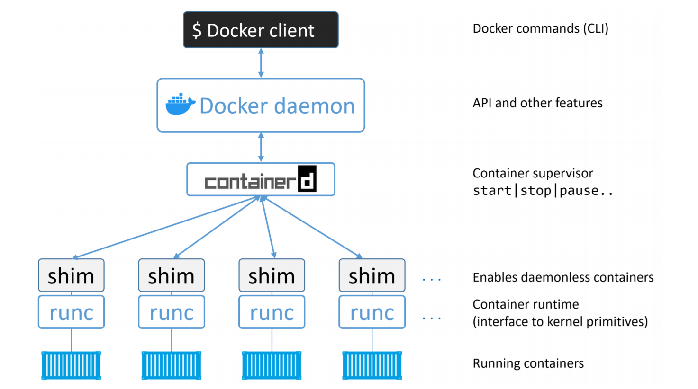

# Docker Engine

### 1. Docker Engine - The TLDR

`Docker engine` là công cụ cốt lỗi để chạy và quản lý container.

Các thành phần chính của docker engine là `docker daemon`, `containerd`, `runc` và các plugin khác nhau như: network, storage. 

### 2. Docker Engine - The Deep Dive

Khi docker lần đầu tiên được phát hành, nó có 2 thành phần chính: 

- The Docker daemon
- LXC

Docker daemon chứa tất cả code cho: `Docker lient`, `Docker API`, `container runtime`, `image builds`, ..

LXC cung cấp cho daemon quyền truy cập vào các buiding-blocks cơ bản của container tồn tại trong linux kernel. Những thứ cơ bản như `namespaces` và  `control groups` 

#### 2.1. Getting rid of LXC

Đầu tiên, LXC dành riêng cho linux. Đây là 1 vấn đề với dự án có ý định trở thành đa nền tảng

Tiếp theo, phát triển dự án cốt lõi mà phải phụ thuộc vào 1 công cụ bên ngoài là 1 rủi ro lớn chản trở sự phát triển. 

Kết quả là Docker đã phát triển công cụ của riêng họ là `libcontainer` để thay thế cho LXC. Mục đích của `libcontainer` là `platform-agnostic` cung cấp cho docker quyền truy cập vào các `building-blocks` cơ bản của container tồn tại trong linux kernel. 

Libcontainer đã thay thế LXC làm `execution driver` mặc định trong Docker 0.9.

#### 2.2. Getting rid of the monolithic Docker daemon

Theo thời gian, bản chất của Dcoker daemon ngày cảng trở nên có vấn đề: 

1. Khó để đối mới
2. Nó trở nên chậm hơn
3. Nó không phù hợp với hệ sinh thái

Docker,INC đã nhận thức được những thách thức này và bắt đầu 1 nỗ lực để module hóa daemon. Mục đích của việc này là tách ra càng nhiều chức năng từ deamon càng tốt và triển khai lại trong các công cụ chuyên dụng nhỏ hơn. Các công cụ chuyên dụng này có thể được hoán đổi cũng như dễ dàng được bên thứ 3 sử dụng lại để xây dựng các công cụ khác. 

#### 2.3. The influence of the Open Container Initiative (OCI)

OCI phát triển 2 thông số kỹ thuật liên quan đến container là: 

1. Image spec
2. Container runtime spec

Cả 2 thông số đều được phát hành dưới dạng phiên bản 1.0 vào tháng 7 năm 2017. Image spec phát hành v1.0.1 vào tháng 11 năm 2017, thông số runtime spec được phát hành tháng 3 năm 2020. 

Kể từ docker 1.11, công cụ Docker triển khai các thông số kỹ thuật OCI càng chặt chẽ càng tốt. (Daemon Docker không còn chứa bất kỳ container runtime code nào nữa, thay vào đó tất cả container runtime code sẽ được triển khai trong 1 lớp tuân thủ OCI riêng biệt. Theo mặc định, docker sử dụng runc(container runtime spec) cho việc này.)

#### 2.4. runc

runc có 1 mục đích duy nhất là tạo các container. 

#### 2.5. containerd

Mục đích của containerd là quản lý hoạt động vòng đời của container: start, stop, pause, rm ... 

#### 2.6. Starting a new container (example)

Khi daemon nhận được lệnh tạo 1 container mới, nó sẽ thực hiện 1 cuộc gọi tới containerd (vì docker daemon không còn chứa bất kỳ mã nào để tạo container). Ssau đó containerd chuyển đối image thành 1 gói OCI và yêu cầu runc tạo 1 container mới. runc giao tiếp với OS kernel để tập hợp các cấu trúc cần thiết để tạo 1 container. 

#### 2.7. One huge benefit of this model

Lợi ích to lớn của mô hình này là runc thoát khỏi docker daemon. Nên khi thực hiện bảo trì và nâng cấp trên docker daemon không làm ảnh hưởng tới container đang chạy. 

#### 2.8. What’s this shim all about?

shim là thành phần không thể thiếu trong việc triển khai các daemonless containers. 

Containerd sử dụng runc để tạo các container mới. Trên thực tế, nó sẽ tạo ra 1 instance mới cho mọi container mà nó tạo ra. Tuy nhiên khi mỗi container được tạo, tiến trình runc cha sẽ exit. Có nghĩa là ta có thể chạy hàng trăm container mà không cần phải chạy hàng trăm runc instance 

Sau khi runc cha thoát, quy trình containerd-shim sẽ trở thành process cha của container. 

#### 2.9. How it’s implemented on Linux

Trong hệ thống linux, các thành phần ta đã nói phía trên được triển khai như sau: 

- dockerd (Docker daemon)
- docker-containerd (containerd)
- docker-containerd-shim (shim)
- docker-runc (runc)

#### 2.10. What’s the point of the daemon

Sau khi loại bỏ runtime code và excution, docker daemon, 1 số chức năng chính vẫn tồn tại trong daemon bao gồm: quản lý image, build image, API, authentication, security, core network, orchestration. 

#### 2.11. Securing client and daemon communication

Docker triển khai mô hình client-server. 

- Client triển khai CLI

- Server (daemon) triển khai chức năng bao gồm API REST

Client được gọi là `docker` và daemon được gọi là `dockerd`. Cài đặt mặc định đặt chúng ở trên cùng 1 máy chủ lưu trữ và cấu hình chúng để giao tiếp qua ổ cắm IPC socket cục bộ. 

trên linux: `/var/run/docker.sock` 

Ta cũng có thể định cấu hình để chúng giao tiếp với nhau qua mạng. Theo mặc định, chúng giao tiếp với nhau qua cổng 2375/tcp. 

