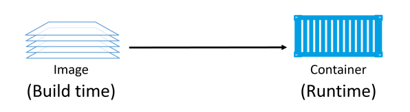
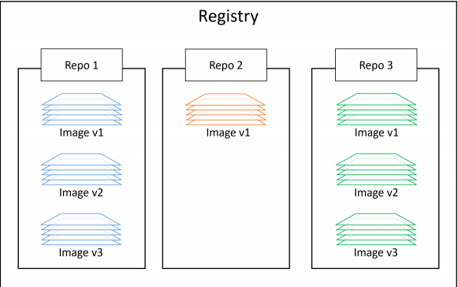

# Images

## 1. Docker images - The TLDR

Image docker là 1 đơn vị đóng gói chứa mọi thứ cần thiết để 1 ứng dụng chạy. Nó bao gồm application code, application dependencies, OS constructs. Nếu bạn có 1 image docker của 1 ứng dụng, để chạy ứng dụng đó, ta cần 1 máy chạy docker. 

Ta sẽ nhận được image docker bằng các pulling từ image registry. Cơ quan registry phổ biến nhất là Docker Hub, nhưng vẫn tồn tại các cơ quan khác. Thao tác pulling sẽ tải image xuống máy chủ Docker, nơi docker có thể sử udngj nó để khởi động 1 hoặc nhiều container. 

Image được tạo thành từ nhiều lớp xếp chồng lên nhau và được biểu diễn dưới dạng 1 đối tượng duy nhất. Bên trong image là 1 hệ điều hành bị cắt giảm và tất cả các phụ thuộc cần thiết để chạy 1 ứng dụng. 

## 2. Docker images -the deep dive

Trên thực tế, bạn có thể dừng 1 container và tạo 1 immage từ nó. Với suy nghĩ này, image được coi là build-time trong khi container là cấu trúc run-time. 



### 2.1. Images and containers

Sử dụng `docker container run` hoặc `docker service create` để bắt đầu 1 hoặc nhiều container từ 1 image.
Khi bạn bắt đầu container từ 1 image, hai cấu trúc trở nên phụ thuộc vào nhau và bạn không thể xóa image cho đến khi container cuối cùng sử dụng nó đã bị dừng và xóa. Cố xóa 1 image  mà không dừng lại và hủy tất cả các vùng chứa bằng cách sử dụng nó sẽ dẫn đến lỗi. 

### 2.2. Images are usually small

Mục đích của container là chạy 1 ứng dụng hoặc dịch vụ duy nhất. Có nghĩa là ứng dụng nó chỉ cần code vầ các phụ thuộc của nó để có thể chay, mà không cần các thứ khác. Dẫn đến image tước bỏ tất cả những phần không thiết yếu. 

### 2.3. Image naming

### 2.4. Image registries

Image được lưu trữ ở 1 nơi tập trung gọi là `image registries`. Điều này giúp cho việc chia sẻ và truy cập được dễ dàng. 

Nơi lưu trữ phổ biến là [Docker Hub](https://hub.docker.com). 

Cách lưu trữ trong `image registries`:



#### 2.5.1. Official and unofficial repositories

Docker Hub có 2 khái niệm là lưu trữ chính thức (official repositories) và lưu trữ không chính thức (unoffical repositories)

`official repositories` đã được Docker kiểm tra và quản lý. 
`unofficical repositories` không được quản lý bởi docker.

Một số repo chính thức: 

```
nginx: https://hub.docker.com/_/nginx/
busybox: https://hub.docker.com/_/busybox/
redis: https://hub.docker.com/_/redis/
mongo: https://hub.docker.com/_/mongo/
```

Một số repo không chính thức:

```
nigelpoulton/tu-demo — https://hub.docker.com/r/nigelpoulton/tu-demo/
nigelpoulton/pluralsight-docker-ci — https://hub.docker.com/r/nigelpoulton/pluralsight-docker-ci/
```

### 2.6. Image naming and tagging

Để pull 1 image từ repo chính thức, ta chỉ cần chỉ ra tên của repo và tag, cách nhau bởi dấu `:`. 

Ví dụ:

```
docker image pull <repository>:<tag>
```

Để thêm 1 image từ repo không chính thức, cũng giống như repo chính thức nhưng ta thêm tên của người dùng docker hub hoặc tên của tổ chức . 

VD: 

```
docker image pull nigelpoulton/tu-demo:v2
```

Nếu thêm image từ 1 bên thứ 3, ta phải thêm trước kho lưu trữ tên của bên thứ 3 đó. 

vd: 

```
docker image pull gcr.io/google-containers/git-sync:v3.1.5
```

### 2.7. Images with multiple tags

để pull tất cả các image trong 1 repo, sử dụng tùy chọn `-a` vào lệnh `docker image pull`. 

vd: 

```
docker image pull -a mongo
```

```
root@dockersrv:~# docker image ls | grep "mongo"
mongo                  4.2.6               3f3daf863757        10 months ago       388MB
mongo                  3-stretch           27d820d7098b        23 months ago       373MB
mongo                  3-jessie            b9406b8a16ec        2 years ago         368MB
mongo                  2                   1999482cb0a5        4 years ago         391MB
mongo                  2.6                 1999482cb0a5        4 years ago         391MB
mongo                  2.6.12              1999482cb0a5        4 years ago         391MB
mongo                  2.4                 2affaf1f84e0        4 years ago         342MB
mongo                  2.4.14              2affaf1f84e0        4 years ago         342MB
mongo                  2.2                 8558fe135d54        4 years ago         237MB
mongo                  2.2.7               8558fe135d54        4 years ago         237MB
mongo                  2.6.11              f36fb0070896        5 years ago         391MB
mongo                  2.6.10              54fb6f9984dd        5 years ago         393MB
mongo                  2.6.9               0eb5bcb2f408        5 years ago         392MB
mongo                  2.4.13              1bc8a1a8ad40        5 years ago         344MB
mongo                  2.6.8               f287f6ca320f        5 years ago         393MB
mongo                  2.6.7               0fa5e3f671a7        6 years ago         392MB
mongo                  2.4.12              ae5e97f89258        6 years ago         345MB
mongo                  2.8                 4af37f2deb97        6 years ago         225MB
mongo                  2.8.0               4af37f2deb97        6 years ago         225MB
mongo                  2.8.0-rc5           4af37f2deb97        6 years ago         225MB
mongo                  2.8.0-rc4           c732b27ee3d6        6 years ago         224MB
mongo                  2.6.6               7632cab977f9        6 years ago         392MB
mongo                  2.8.0-rc3           84a5935d697f        6 years ago         224MB
mongo                  2.8.0-rc0           afb23b2838b9        6 years ago         224MB
mongo                  2.6.5               6e2f39336075        6 years ago         392MB
mongo                  2.7                 1bc6f44f84be        6 years ago         217MB
mongo                  2.7.8               1bc6f44f84be        6 years ago         217MB
mongo                  2.7.7               e29d06d58a5e        6 years ago         237MB
mongo                  2.4.11              be2b25bde5f5        6 years ago         345MB
mongo                  2.6.4               d90d629f1e23        6 years ago         391MB
mongo                  2.7.6               18400f87db91        6 years ago         381MB
mongo                  2.4.10              9ee0bcea2cbf        6 years ago         345MB
mongo                  2.7.5               5f79484e67e9        6 years ago         379MB
mongo                  2.6.1               f4eb787e7fd8        6 years ago         748MB
```
### 2.8. Filtering the output of `docker image ls`

docker cung cấp  `--filter` để lọc danh sách các image được trả về. 

### 2.9. Images and layers

Images Docker là 1 loạt các layer read-only được kết nối với nhau. Mỗi layer bao gồm 1 hoặc nhiều file. 

Thực tế, khi ta pull 1 image, ta sẽ thấy các layer của image đó:

```
root@dockersrv:~# docker image pull nigelpoulton/tu-demo:v2
v2: Pulling from nigelpoulton/tu-demo
aad63a933944: Pull complete
f229563217f5: Pull complete
bce07ec39263: Pull complete
7fd926f0f7cc: Pull complete
075e2aee5115: Pull complete
5137e9939cc3: Pull complete
bbdb38d27074: Pull complete
93028469a194: Pull complete
9ff7e7aa4c70: Pull complete
Digest: sha256:c9f8e1882275d9ccd82e9e067c965d1406e8e1307333020a07915d6cbb9a74cf
Status: Downloaded newer image for nigelpoulton/tu-demo:v2
docker.io/nigelpoulton/tu-demo:v2
```

Mỗi dòng kết thúc bằng `Pull complete` đại diện cho 1 layer đã được pull. 

Một cách khác để xem các layer của image là sử dụng `docker image inspect`:

```
root@dockersrv:~# docker inspect mongo:4.2.6
[
    {
        "Id": "sha256:3f3daf8637573f4568ba35ee0f818aa25384f547b6e9cfa0c9bf39b92d5a63da",
        "RepoTags": [
            "mongo:4.2.6"
        ],
        ...,
        "RootFS": {
            "Type": "layers",
            "Layers": [
                "sha256:b7f7d2967507ba709dbd1dd0426a5b0cdbe1ff936c131f8958c8d0f910eea19e",
                "sha256:a6ebef4a95c345c844c2bf43ffda8e36dd6e053887dd6e283ad616dcc2376be6",
                "sha256:838a37a24627f72df512926fc846dd97c93781cf145690516e23335cc0c27794",
                "sha256:28ba7458d04b8551ff45d2e17dc2abb768bf6ed1a46bb262f26a24d21d8d7233",
                "sha256:081e093b05409b036ea99b64c5a8ac46bce528e70178dad21970fbfdc2190c64",
                "sha256:63c5a29626008451402e344c77ea68deba319f105d083d719071796ed667232a",
                "sha256:814c60bd0a7beb6b36c5ad2d707e2a77548a3b879c0d01da0f7c280b7a77e337",
                "sha256:f42c31ea970ded96a424219f42f4b921fa52465b3f2b3d03d1dadec09b638b47",
                "sha256:ab5d47dfdcb864458ba539468058d28188840582fac981a1797150417596e5b9",
                "sha256:910e3db7778913724826b72318af53d92b273e5c5910a9d9b32cc3bece091094",
                "sha256:633f259f3a9f233af93e8afb11c59f054f383254f6f031fa6b75c9daf36a8d6a",
                "sha256:8189bff552513a43a62acd4213cc29266cb94a6d9719b1971737d2d057cddb2b",
                "sha256:23d91afd9b9345dc437e35e33f8d1d9997925cb1a3e025c6b8643d6b817b81e2"
            ]
        },
        "Metadata": {
            "LastTagTime": "0001-01-01T00:00:00Z"
        }
    }
]
```

Docker sử dụng `storage driver` để chịu trách nhiệm cho việc xếp chồng các layer và trình bày chúng như 1 thế thống nhất. Ví dụ về `storage driver` bao gồm: `AUFS`, `overlay2`, `devicemapper`, `btrfs` và `zfs`. 

### 2.10. Sharing image layers

Nhiều image có thể chia sẻ layer, nó dẫn đến hiệu quả về không gian và hiệu suất. 

Khi pull image, các dòng kết thúc là `Already exists` tức là đã tồn  tại.

```
2.8.0-rc4: Pulling from library/mongo
Image docker.io/library/mongo:2.8.0-rc4 uses outdated schema1 manifest format. Please upgrade to a schema2 image for better future compatibility. More information at https://docs.docker.com/registry/spec/deprecated-schema-v1/
a3ed95caeb02: Pull complete
ee48d0fb051e: Already exists
785429c6e4b2: Already exists
60f811ea05a5: Already exists
30eeb62267ea: Already exists
4a806b90a51b: Already exists
a91900b8023e: Pull complete
8aac0828f4dc: Pull complete
8a77cd9c2154: Pull complete
Digest: sha256:173da3f554052949ce3baec9740fae6e79eda91592029e46f7653aa956289376
```

### 2.11. Pulling images by digest

Sử dụng digests để xem thông tin chi tiết về image

```
root@dockersrv:~# docker image ls --digests mongo
REPOSITORY          TAG                 DIGEST                                                                    IMAGE ID            CREATED             SIZE
mongo               4.2.6               sha256:c880f6b56f443bb4d01baa759883228cd84fa8d78fa1a36001d1c0a0712b5a07   3f3daf863757        10 months ago       388MB
mongo               3-stretch           sha256:0a1d6cd8790b49ed471ed2197f37b3a812c4226962768603b024703f8b74260d   27d820d7098b        23 months ago       373MB
mongo               3-jessie            sha256:c2f6293248cb617bad30db9d2d569ba670ff4c5f9d7ed4764e1db8436fce0673   b9406b8a16ec        2 years ago         368MB
mongo               2                   sha256:08e199598f4f874d14b4f90727dade0384b0fcfe8479355ed2cc5391c46e8ece   1999482cb0a5        4 years ago         391MB
mongo               2.6                 sha256:08e199598f4f874d14b4f90727dade0384b0fcfe8479355ed2cc5391c46e8ece   1999482cb0a5        4 years ago         391MB
mongo               2.6.12              sha256:08e199598f4f874d14b4f90727dade0384b0fcfe8479355ed2cc5391c46e8ece   1999482cb0a5        4 years ago         391MB
mongo               2.4                 sha256:cb40b710f355cfe68a9fecc021a4726b8f2eb61bb66978d1b1f9b5c4f9244350   2affaf1f84e0        4 years ago         342MB
mongo               2.4                 sha256:fa5f00c5e51e8dcd4070c2334cdbfc34904a802eef615dcac848def72189e7e6   2affaf1f84e0        4 years ago         342MB
mongo               2.4.14              sha256:cb40b710f355cfe68a9fecc021a4726b8f2eb61bb66978d1b1f9b5c4f9244350   2affaf1f84e0        4 years ago         342MB
mongo               2.4.14              sha256:fa5f00c5e51e8dcd4070c2334cdbfc34904a802eef615dcac848def72189e7e6   2affaf1f84e0        4 years ago         342MB
mongo               2.2                 sha256:1e164f0403ae362c4e4ffee84b9611df9c26aa28b397025597555a43a16d8ca9   8558fe135d54        4 years ago         237MB
mongo               2.2                 sha256:dceb786333aa702437e2ccdfc52301f410295f2d573906ac6b49c78041491f62   8558fe135d54        4 years ago         237MB
mongo               2.2.7               sha256:1e164f0403ae362c4e4ffee84b9611df9c26aa28b397025597555a43a16d8ca9   8558fe135d54        4 years ago         237MB
mongo               2.2.7               sha256:dceb786333aa702437e2ccdfc52301f410295f2d573906ac6b49c78041491f62   8558fe135d54        4 years ago         237MB
mongo               2.6.11              sha256:0565e39843b9f8afcffde02ad1ac5c2c257a87c07b2ba5903cbfee1ac852b79e   f36fb0070896        5 years ago         391MB
mongo               2.6.10              sha256:098e6222ce83aeb9e07d1e64c606362d9e9def69ea4f0b5f2f366acf5f967029   54fb6f9984dd        5 years ago         393MB
mongo               2.6.9               sha256:28278a53ec228afb4e8886f9c641b6ec48fa46a548dfd952d6c65b1a42ef2ff1   0eb5bcb2f408        5 years ago         392MB
mongo               2.4.13              sha256:32e516384aebdfbce721531a774e782137293ac222057cadbbe7f4113fa8031a   1bc8a1a8ad40        5 years ago         344MB
...
```

Ta có thể sử dụng giá trị digest để pull các image

VD:

```
root@dockersrv:~# docker image pull mongo@sha256:0a1d6cd8790b49ed471ed2197f37b3a812c4226962768603b024703f8b74260d
sha256:0a1d6cd8790b49ed471ed2197f37b3a812c4226962768603b024703f8b74260d: Pulling from library/mongo
27833a3ba0a5: Pull complete
179c807caa04: Pull complete
2b23ef1b0ab3: Pull complete
e3cf7dbbd547: Pull complete
dc233bb2f309: Pull complete
ef26a67bf04e: Pull complete
55ecb543777e: Pull complete
35f8c6ed1ba6: Pull complete
2a39da2ca07c: Pull complete
3fa5f1b76807: Pull complete
Digest: sha256:0a1d6cd8790b49ed471ed2197f37b3a812c4226962768603b024703f8b74260d
Status: Downloaded newer image for mongo@sha256:0a1d6cd8790b49ed471ed2197f37b3a812c4226962768603b024703f8b74260d
docker.io/library/mongo@sha256:0a1d6cd8790b49ed471ed2197f37b3a812c4226962768603b024703f8b74260d
```

### 2.12. Multi-architecture images

Image Docker có thể hỗ trợ nhiều kiến trúc, có nghĩa là 1 image có thể chứa nhiều biến thể cho các kiến trúc khác nhau và đôi khi cho các hệ điều hành khác nhau. 

Khi chạy 1 image hỗ trợ multi-architecture, docker sẽ tự động chọn 1 biến thể image phù hợp với hệ điều hành và kiến trúc của máy. 
Hầu hết các image đều cung cấp nhiều loại kiến trúc khác nhau

### 2.13. Deleting Images

Khi không còn cần image trên docker của mình nữa, ta có thể xóa image sử dụng `docker image rm`. Khi xóa nó sẽ xóa tất cả các image và các layer của nó. Tuy nhiê, nếu 1 layer của image chia sẻ cho nhiều image khác thì layer đó sẽ không bị xóa  đến khi tất cả các image tham chiếu đến nó bị xóa hết. 

VD:

```
root@dockersrv:~# docker image rm mongo:3-stretch
Untagged: mongo:3-stretch
Untagged: mongo@sha256:0a1d6cd8790b49ed471ed2197f37b3a812c4226962768603b024703f8b74260d
Deleted: sha256:27d820d7098b15b0d6068602829923e6c4b41bcf0ade658ed0c1870c1de92cb8
Deleted: sha256:b1ee229e143880a1d73a1c0b7323d948561be5f61e1ef90375621dfc698f6c59
Deleted: sha256:8b4a1814b5345e4e9b8f2c83a278a2f50b3405f8a459199753b2dc3823d2b789
Deleted: sha256:6f7b7d4ee701d7bb8c98b197a6a04ad4d3fb3fe87e3073d6a3d60596b7961fb0
Deleted: sha256:f4aa99854347737a34b3a541a2a1362046b128dcd1168fb1b3cc789d55553d7b
Deleted: sha256:e373be77356629318055f4088676a04942a597ef66e5fa409d58b6d9216dbb93
Deleted: sha256:b9e28f8c7b5b375b831d835edbddcde369e184db1aa7c3d5e5245441e8b1a5de
Deleted: sha256:97a7562adc7a05b8689d822ff2e1d5cb191dd00c072a5798c81a3b533bc28678
Deleted: sha256:6fd508e0bc51dd486f70cf3d33523241c6c0fc9c2ae72e466f44e295f334b51a
Deleted: sha256:c22e25de1a389ee58fb7d89a4c3c4a5b3998ecefadcd464c51e338784577e0de
Deleted: sha256:5dacd731af1b0386ead06c8b1feff9f65d9e0bdfec032d2cd0bc03690698feda
```

Có thể xóa nhiều imahe như sau: 

```
root@dockersrv:~# docker image rm d5e1e48cf932 27d820d7098b
Untagged: nigelpoulton/tu-demo:v2
Untagged: nigelpoulton/tu-demo@sha256:c9f8e1882275d9ccd82e9e067c965d1406e8e1307333020a07915d6cbb9a74cf
Deleted: sha256:d5e1e48cf932ef80c06376301372417655117499296d22c01ec033e16b91725a
Deleted: sha256:1382ba490d8828155a86a238d88ab271e3e69e2b94ebcafcab887ef58d65f809
Deleted: sha256:412fe2f6a42669f6c808845d658afc44a096a1bc70d2c26cf1fa50dfb01fb66b
Deleted: sha256:103e4d7a68004e8768cfe98cb81d382757137b5a07bc46f6af47e816c18f8979
Deleted: sha256:f09ab044209a7f7d4793f9e7b12b5cabf4de00429df383c44a1302fad78c831a
Deleted: sha256:0b03063a13c53a18dd2db3546822fd563736a1a01a6b50f2e5aaf92ac490e72d
Deleted: sha256:dbb407f74d84e0e2513b1bd63a7a216a2b084ccef72f634f31bbede3968ac6ba
Deleted: sha256:e0cf834dcac27a0e8b152807c73aad7098d8988be0f80e849db9c497718d75ac
Deleted: sha256:9e5f8d6d3f018d99738e898f4b5f22290e590c0801544b7975d445cfb9447655
Deleted: sha256:beee9f30bc1f711043e78d4a2be0668955d4b761d587d6f60c2c8dc081efb203
Untagged: mongo@sha256:0a1d6cd8790b49ed471ed2197f37b3a812c4226962768603b024703f8b74260d
Deleted: sha256:27d820d7098b15b0d6068602829923e6c4b41bcf0ade658ed0c1870c1de92cb8
Deleted: sha256:b1ee229e143880a1d73a1c0b7323d948561be5f61e1ef90375621dfc698f6c59
Deleted: sha256:8b4a1814b5345e4e9b8f2c83a278a2f50b3405f8a459199753b2dc3823d2b789
Deleted: sha256:6f7b7d4ee701d7bb8c98b197a6a04ad4d3fb3fe87e3073d6a3d60596b7961fb0
Deleted: sha256:f4aa99854347737a34b3a541a2a1362046b128dcd1168fb1b3cc789d55553d7b
Deleted: sha256:e373be77356629318055f4088676a04942a597ef66e5fa409d58b6d9216dbb93
Deleted: sha256:b9e28f8c7b5b375b831d835edbddcde369e184db1aa7c3d5e5245441e8b1a5de
Deleted: sha256:97a7562adc7a05b8689d822ff2e1d5cb191dd00c072a5798c81a3b533bc28678
Deleted: sha256:6fd508e0bc51dd486f70cf3d33523241c6c0fc9c2ae72e466f44e295f334b51a
Deleted: sha256:c22e25de1a389ee58fb7d89a4c3c4a5b3998ecefadcd464c51e338784577e0de
Deleted: sha256:5dacd731af1b0386ead06c8b1feff9f65d9e0bdfec032d2cd0bc03690698feda
```

Xóa tất cả các image ta sử dụng lệnh sau: 

```
docker image rm $(docker image ls -q) -f
```

## 3. Images - The commands

`docker image pull`: pull image từ repo
`docker image ls`: Liệt kê các image 
`docker image inspect`: Cung cấp các thông tin của 1 image
`docker manifest inspect`: 
`docker buildx`: 
`docker image rm`: Xóa 1 hoặc nhiều image

