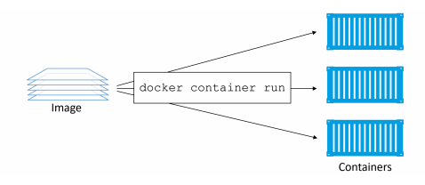
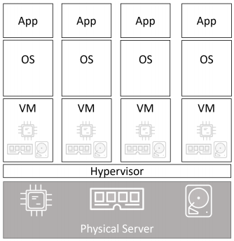
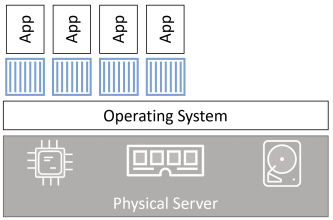

# Containers

## 1. Docker Containers - The TLDR

Một image có thể sử dụng để tạo 1 hoặc nhiều container. Cách đơn giản nhất để start 1 container là sử dụng `docker container run`.



## 2. Docker containers - The deep dive

### 2.1. Containers vs VMs

Cả Containers và VMs để cần host để chạy. 

Trong mô hình VM, sau khi các server vật lý được bật, các hypervisor được khởi động. Sau đso hypervisor sẽ xác nhận quyền sở hữu đối với tất cả các tài nguyên vật lý trên hệ thống như RAM, CPU, storage và NICs. Sau đó, nó khắc các tài nguyên phần cứng này thành các phiên bản ảo hóa gọi là VM. Ta sẽ sử dụng các VM để cài đặt hệ điều hành và ứng dụng trên mỗi máy ảo. 



Với mô hình container, Hệ điều hành yêu cầu tất cả các tài nguyên phần cứng. Trên hệ điều hành, ta cài đặt container engine là Docker. Sau đó, công cụ container sẽ lấy các tài nguyên hệ điều hành và ghép chúng lại thành các cấu trúc riêng biệt được gọi là container. Mỗi container giống như 1 hệ điều hành thực sự. Bên trong mỗi container sẽ chạy 1 ứng dụng. 



### 2.2. The VM tax

### 2.3. Running containers

### 2.4. Checking that Docker is running

Kiểm tra các trạng thái của docker

```
service docker status
```
### 2.5. Starting a simple container

Cách đơn giản nhất để start 1 container là sử dụng `docker container run`

```
root@dockersrv:~# docker container run -it ubuntu:latest /bin/bash
Unable to find image 'ubuntu:latest' locally
latest: Pulling from library/ubuntu
5d3b2c2d21bb: Pull complete
3fc2062ea667: Pull complete
75adf526d75b: Pull complete
Digest: sha256:b4f9e18267eb98998f6130342baacaeb9553f136142d40959a1b46d6401f0f2b
Status: Downloaded newer image for ubuntu:latest
```

`docker container run` yêu cầu 1 docker chạy 1 container mới. `-it` để tương tác với container và gắn nó bào shell hiện tại.
 
Khi run docker, nếu không tìm thấy ở local, nó sẽ lên Docker Hub để tìm kiếm, nếu tìm thấy nó sẽ pull về local. Sau khi image được pull, `containerd` và `runc` sẽ hướng dẫn nó tạo và start container. 

### 2.6. Container processes

Khi khởi động 1 container và yêu cầu nó chạy bashshell. Điều này làm cho bashshell là tiến trình duy nhất chạy bên trong container.

Nếu khi truy cập container và nhập `exit`, nó sẽ chấm dứt tiến trình bash và container sẽ stop. 

Để thoát khỏi container mà không dừng tiến trình chính, sử dụng `Ctrl-PQ`

Nếu muốn truy cập 1 container đang chạy, ta gắn cho nó terminal sử dụng `docker container exec` 

VD: 

```
docker container exec -it c8a6d41c0290 bash
```

Để dừng container, sử dụng `docker container stop`

```
docker container stop a65616b9b82d
```

Sau khi stop, ta mới có thể xóa container. 

```
docker container rm a65616b9b82d
```

### 2.7. Container lifecycle

Khởi động container với lệnh `docker container run`

Dừng 1 container với lệnh `docker container stop`

Kiểm tra các container đang running sử dụng lệnh `docker container ls`

Để liệt kê cả các container đã dừng và container đang running, sử dụng thêm tùy chọn `-a`: `docker container ls -a`

Bắt đầu lại 1 container bị stop `docker container start`

Có thể xóa container đang chạy với tùy chọn `-f` : `docker container rm -f <containerid>`. Nếu không sử dụng tùy chọn `-f`, trước tiên ta phải dừng container rồi mới xóa nó. 

### 2.8. Stopping containers gracefully

### 2.9. Self-healing containers with restart policies

Các chính sách khởi động lại được áp cho mỗi container và có thể được định cấu hình với `docker-container run`, hoặc khai báo trong các tệp YAML để sử dụng với các công cụ cấp cao hơn như Docker Swam, Docker Compose, Kubernet.

Tồn tại các chính sách khởi động lại sau: 

`always`
`unless-stopped`
`on-failed`

- Always đơn giản nhất, nó luôn khởi động lại container đã dừng, trừ khi nó được dừng bằng `docker container stop`. 
 
- Unless-Stopped là container sẽ không khởi động lại khi daemon khởi động lại nếu nó được đặt trong `Stopped (Exited) state`. 

- on-failed sẽ khởi động lại container nếu nó exit với `exit code` khác 0. Nó cũng khởi động lại các container khi docker daemon restart, ngay cả khi cotainer ở trạng thái stop. 

### 2.10. Web server example

Sử dụng tùy chọn `-p` để ánh xạ cổng 80 thành 8080 đối với dịch vụ web. 

```
docker container run -d --name webserver -p 80:8080 \
nigelpoulton/pluralsight-docker-ci
```

### 2.11. Inspecting containers

### 2.12. Tidying up

Chạy lệnh sau để xóa tất cả các container

```
docker container rm $(docker container ls -aq) -f
```

## 3. Containers - The commands

`docker container run `

`Ctrk-PQ`

`docker container ls`

`docker container exec`

`docker container stop`

`docker container start` 

`docker container rm`

`docker container inspect`


