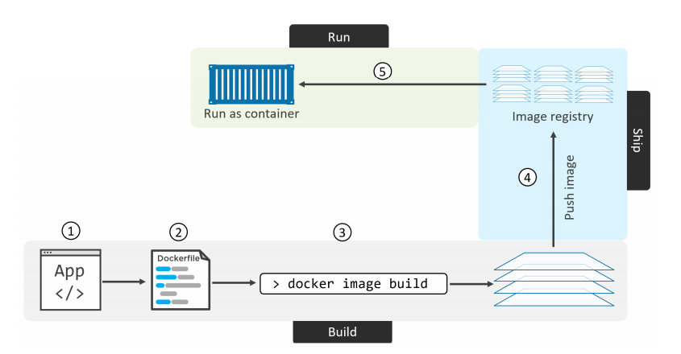

# Containerizing an app

## 1. Containerizing an app - The TLDR

Container nhằm làm cho các ứng dụng trở trên dễ dàng build, ship và run. 

Quá trình chứa 1 ứng dụng: 

1. Bắt đầu với code app và các phụ thuộc
2. Tạo `Dockerfile` mô tả ứng dụng, các phụ thuộc và cách chạy nó. 
3. Nạp `Dockerfile` vào lệnh `docker image build`
4. Push image mới vào registry(option)
5. Run container từ image



## 2. Containerizing an app - The deep dive

### 2.1. Containerize a single-container app

#### 2.1.1. Getting the application code

Down 1 ứng dụng web để thử nghiệm: 

```
git clone https://github.com/nigelpoulton/psweb.git
```

```
cd psweb
```

#### 2.1.2. Inspecting the Dockerfile

Dockerfile là điểm bắt đầu để tạo 1 image container, nó mô tả ứng dung và nói với docker cách để xây dưng nó thành 1 image. Thư mục chứa ứng dụng và các phụ thuộc được gọi là `build context`. Docker file bắt đầu bằng chữ `D` và được đặt tên như sau: `Dockerfile`. Ngoài nó ra các kiểu đặt tên khác không hợp lệ 

```
root@dockersrv:~/psweb# cat Dockerfile 

FROM alpine
LABEL maintainer="nigelpoulton@hotmail.com"
RUN apk add --update nodejs nodejs-npm
COPY . /src
WORKDIR /src
RUN  npm install
EXPOSE 8080
ENTRYPOINT ["node", "./app.js"]
```

Tất cả các tệp `Dockerfile` đều bắt đầu bằng lệnh `FROM`. Đây là lớp cơ sở của image và phần còn lại của ứng dụng sẽ được thêm lên đầu trang như các layer bổ sung. CỤ thể là 1 úng dụng linux, nên FROM đề cập đến 1 image trong linux. 

Tiếp theo, docker tạo ra `LABEL` là người duy trì image. lable là các cặp key-value đơn giản. 

`RUN apk add --update nodejs nodejs-npm` hướng dẫn Alpine apk sử dụng trình quản lý gói để cài đặt `nodejs` và `nodejs-npm` vào image.  Tại thời điểm này, nó tạo ra 1 layer mới ngay trên layer from và cài đặt các gói ở layer này. 

`COPY . /src` tạo 1 layer mới khác và copy file, thư mục từ host machine vào image. Có thể sử dụng url cho tập tin cần copy. 

Tiếp theo, `Dockerfile` sử dụng `WORKDIR` để đặt thư mục làm việc bên trong image file system

`VOLUME` mount hư mục từ máy host vào container

`RUN` để thực thi caai lệnh nào đó trong quá trinhg buil inmage

`EXPOSE` container sẽ lắng nghe trên các cổng mạng được chỉ định khi chạy. 

`ENTRYPOINT` để thực thi một số câu lệnh trong quá trình start container, những câu lệnh này sẽ dk viết trong file .sh

#### 2.1.3. Containerize the app/build the image

Sử dụng `docker image build` để build 1 image mới gọi là `web:latest`. Dấu `.` yêu cầu Docker sử dụng thư mục làm việc hiện tại của shell làm `build context`(thư mục chứa file Dockerfile) 

```
docker image build -t web:latest .
```

Liệt kê các image để kiểm tra: 

```
root@dockersrv:~/psweb# docker image ls 

REPOSITORY                           TAG                 IMAGE ID            CREATED             SIZE
web                                  latest              b0e41055ddb3        10 minutes ago      93.5MB
```

#### 2.1.4. Pushing images

Để đẩy 1 image lên `Docker Hub`, bạn cần login với `Docker ID`. Bạn cũng cần gắn thẻ image thích hợp. 

Sử dụng lệnh `docker login` để đăng nhập vào docker. 

Trước khi đẩy 1 image, ta phải gắn thẻ nó theo 1 cách đặc biệt. Khi đẩy lên `Docker Hub`, ta phải thêm ID docker vào trước. 

```
docker image tag web:latest nigelpoulton/web:latest
```

Sau khi thay dổi tag, có thể push lên docker hub: 

```
docker image push nigelpoulton/web:latest
```

#### 2.1.5. Run the app

Chạy docker và trỏ port 80 từ Docker host đến port 8080 trong container. 
```
 docker container run -d --name c1 \
-p 80:8080 \
web:latest
```

Sau đó xác minh ánh xạ cổng:

```
CONTAINER ID        IMAGE                 COMMAND                  CREATED             STATUS                          PORTS                    NAMES
40870fab83b5        web:latest            "node ./app.js"          19 seconds ago      Up 18 seconds                   0.0.0.0:80->8080/tcp     c1
```

#### 2.1.6. Looking a bit closer

Tất cả các dòng không phải comment đều là hướng dẫn và có định dạng INSTRUCTION argument. Tên của instruction không phân biệt chữ hoa chữ thường nhưng viết hoa khiến chúng dễ phân biệt hơn. 
Một số intrucstion tạo các layer trong khi những intrucstion  khác chỉ thêm metadata và config file. 

Các intrucstion tạo các layer mới là `FROM`, `RUN`, `COPY`. Một số intruction tạo metadata như: `EXPOSE`, `WORKDIR`, `ENV`, and `ENTRYPOINT`. 
Tiền đề là: nếu 1 intrucstion thêm nội dung như file hoặc chương trình vào image, nó sẽ tạo 1 layer mới. Nếu intrucstion thêm hướng dẫn về cách build image và chạy các ứng dụng, nó sẽ tạo metadata. 

### 2.2. Moving to production with Multi-stage Builds

Multi stage là phương pháp tổ chức Dockerfile  để giảm thiểu kích thước của container cuối cùng. Việc build theo multi stage được thực hiện bằng cách tạo các phần khác nhau của Dockerfile, mỗi phần tham chiếu đến 1 image cơ sở khác nhau. 

Multi-stage build cho phép giảm thiểu kích thước thực của docker container mà ta triển khai, vì các layer khác nhau không còn được lưu trữ trong container cuối cùng. 

Đầu tiên, docker có 3 FROM, mỗi trong số nay tạo thành 1 build stage riêng biệt. Nó được đánh số bắt đầu từ 0. 

### 2.3. A few best practices

#### 2.3.1. Squash the image

Image khi bị squash không chia sẻ các image layer. Điều này có thể dẫn đến lưu trữ không hiệu quả.

Thêm cờ `--squash` vào `docker image build` nếu bạn muốn tạo 1 image squashed. 

image bình thường chia sẻ layer với các image khác trên máy, còn image bị squashed thì không. 
image bị squashed sẽ cần gửi từng byte đến Docker Hub bằng lệnh `docker image push` trong khi image không bị squashed chỉ cần gửi các layer duy nhất. 

#### 2.3.2. Use no-install-recommends

Sử dụng `no-install-recommends` giúp cho việc chỉ cài đặt các gói phụ thuộc chính và không recommend hoặc suggested các gói


