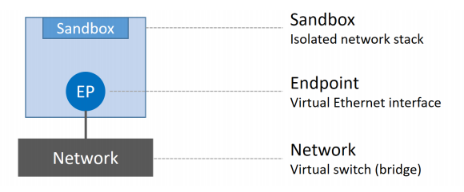
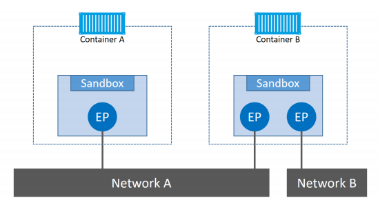

# Docker Networking 

## 1. Docker Networking - The TLDR

Theo mặc định sau khi cài đặt, docker tạo ra 3 card mạng mặc định là Bridge, host, only

Khi tạo container mà không dùng network nào, docker sẽ dùng dải bridge. 

## 2. Docker Networking - The Deep Dive

### 2.1. The theory

Ở mức cao nhất, docker network bao gồm 3 thành phần chính: 

- The Container Network Model (CNM)
- libnetwork
- Drivers

CNM là kỹ thuật thiết kế, phác thảo các khối xây dựng cơ bản của docker network
`libnetwork` là triển khai thực tế của CNM được sử dụng bởi Docker. Nó được viết trong Go và các thành phần cốt lõi được nêu trong CNM
`Driver` mở rộng mô hình bằng cách triển khai các cấu trúc liên kết mạng cụ thể như VXLAN overlay networks 

#### 2.1.1. The Container Network Model (CNM)

Design cho Docker network là CNM. Nó phác thảo các khối xây dựng cơ bản của Docker network.

Ở mức cao, nó xác định 3 khối xây dựng lớn: 

- Sandboxes
- Endpoints
- Networks

`Sandbox` là network stack bị cô lập. Nó bao gồm: Ethernet interface, port, routing tables, DNS config

`Endpoints` là virtual network interfaces. Giống như normal network interfaces, nó chịu trách nhiệm giữ các kết nối. Trong trường hợp của CNM, nó là công việc của endpoint để kết nối sandbox với network. 

`Networks` là 1 nhóm các endpoint có thể giao tiếp trực tiếp với nhau. Việc triển khai 1 mạng có thể là 1 linux bridge, 1 VLAN...



Container Network Model là tất cả về việc cung cấp network cho container. Hình dưới đây cho thấy các thành phần CNM liên quan đến các container - các sandboxe được đặt bên trong container để cung cấp kết nối mạng. 




#### 2.1.2. Libnetwork

**Null**

Null là 1 triển khai của noop của API trình điều khiển, chỉ được sử dụng trong các trường hợp không muốn kết nối mạng.

**Bridge**

Cung câp triển khai bridge dành riêng cho linux dựa trên linux bridge

**Overlay**

Overlay thực hiện mạng có thể mở rộng nhiều máy chủ bằng cách sử dụng đóng gói overlay network như VXLAN

**Remote**

remote không cung cấp driver nhưng cung cấp phương tiện hỗ trợ driver từ xa. Điều này có thể được sử dụng để viết các plugin mạng của bên thứ 3 cho Docker. 

### 2.2. Single-host bridge networks

Docker network đơn giản nhất là single-host bridge network

- `Single-host` cho ta biết nó chỉ hoạt động trên 1 máy chủ Docker và chỉ có thể kết nối các conteiner trên cùng 1 máy chủ

- `Bridge` nó là 1 triển khai của switch layer 2

Để xem các network ta dùng lệnh: 

```
root@dockermgr:~# docker network ls
NETWORK ID          NAME                      DRIVER              SCOPE
68266f43c99c        bridge                    bridge              local
1fa4f6a56997        counter-app_counter-net   bridge              local
aa42229cc99c        docker_gwbridge           bridge              local
8b468a1187c0        host                      host                local
1y4ju7ly6qk5        ingress                   overlay             swarm
953f81d1348b        none                      null                local
```

xem chi tiết 1 network, ta sử dụng `docker network inspect`

```
root@dockermgr:~# docker network inspect bridge
[
    {
        "Name": "bridge",
        "Id": "68266f43c99c62aa0008ea1cf2ed667c2255ded113380a5bb4492838543b743e",
        "Created": "2021-03-23T16:34:18.351058524+07:00",
        "Scope": "local",
        "Driver": "bridge",
        "EnableIPv6": false,
        "IPAM": {
            "Driver": "default",
            "Options": null,
            "Config": [
                {
                    "Subnet": "172.17.0.0/16",
                    "Gateway": "172.17.0.1"
                }
            ]
        },
        "Internal": false,
        "Attachable": false,
        "Ingress": false,
        "ConfigFrom": {
            "Network": ""
        },
        "ConfigOnly": false,
        "Containers": {
            "c136344250a902a95c9bf7ae7ef0229f3c2bae258c7e1e67970b17896ca8b72d": {
                "Name": "portainer",
                "EndpointID": "c0ed34aed7a4ce72da0d79e9797cc32030a9979c94f94af88fcf37ea6965dc63",
                "MacAddress": "02:42:ac:11:00:02",
                "IPv4Address": "172.17.0.2/16",
                "IPv6Address": ""
            }
        },
        "Options": {
            "com.docker.network.bridge.default_bridge": "true",
            "com.docker.network.bridge.enable_icc": "true",
            "com.docker.network.bridge.enable_ip_masquerade": "true",
            "com.docker.network.bridge.host_binding_ipv4": "0.0.0.0",
            "com.docker.network.bridge.name": "docker0",
            "com.docker.network.driver.mtu": "1500"
        },
        "Labels": {}
    }
]
```

Ngoài việc sử dụng các network docker cung cấp, có thể tạo các network phù hợp với công việc, ta sử dụng `docker network create`: 

```
docker network create -d bridge hungnet
```

```
root@dockermgr:~# docker network ls | grep "hung"
38118ea2e082        hungnet                   bridge              local
```

```
root@dockermgr:~# docker inspect hungnet
[
    {
        "Name": "hungnet",
        "Id": "38118ea2e082266bd88d4b415d0f635187421a4cf3ece531ee630f5638be8c86",
        "Created": "2021-03-29T08:26:02.068861272+07:00",
        "Scope": "local",
        "Driver": "bridge",
        "EnableIPv6": false,
        "IPAM": {
            "Driver": "default",
            "Options": {},
            "Config": [
                {
                    "Subnet": "172.18.0.0/16",
                    "Gateway": "172.18.0.1"
                }
            ]
        },
        "Internal": false,
        "Attachable": false,
        "Ingress": false,
        "ConfigFrom": {
            "Network": ""
        },
        "ConfigOnly": false,
        "Containers": {},
        "Options": {},
        "Labels": {}
    }
]
```

Để gắn network vào 1 container, ta sử dụng: 

```
root@dockermgr:~# docker run -d --name redis_test --network hungnet redis:alpine
abf821e76ca50b99aa43a103c40b566ff1a555532aeca7121eec179f7016a757
````

Kiểm tra bridge `hungnet`, ta thấy đã có container `redis_test` được gắn vào `hungnet`: 

```
root@dockermgr:~# docker network inspect hungnet
[
    {
        "Name": "hungnet",
        "Id": "38118ea2e082266bd88d4b415d0f635187421a4cf3ece531ee630f5638be8c86",
        "Created": "2021-03-29T08:26:02.068861272+07:00",
        "Scope": "local",
        "Driver": "bridge",
        "EnableIPv6": false,
        "IPAM": {
            "Driver": "default",
            "Options": {},
            "Config": [
                {
                    "Subnet": "172.18.0.0/16",
                    "Gateway": "172.18.0.1"
                }
            ]
        },
        "Internal": false,
        "Attachable": false,
        "Ingress": false,
        "ConfigFrom": {
            "Network": ""
        },
        "ConfigOnly": false,
        "Containers": {
            "abf821e76ca50b99aa43a103c40b566ff1a555532aeca7121eec179f7016a757": {
                "Name": "redis_test",
                "EndpointID": "8ce1eb73f45b7e0629091fc7fd6272d0d990214d77b7c98e52a9ea77df42d9d8",
                "MacAddress": "02:42:ac:12:00:02",
                "IPv4Address": "172.18.0.2/16",
                "IPv6Address": ""
            }
        },
        "Options": {},
        "Labels": {}
    }
]
```

### 2.3. Multi-host overlay networks

`overlay network` là multi-host. 

Overlay network có thể kết nối nhiều container trên các `Docker Engine` lại với nhau, trong môi trường cluster.

Swarm tạo ra overlay network chỉ available với các nodes bên trong swarm . 

### 2.4. Connecting to existing networks

MACVLAN cho phép 1 card interface vật lý có nhiều địa chỉ Mac và địa chỉ IP sử dụng `macvaln sub-interface`. Với macvlan, mỗi sub-interface sẽ có địa chỉ MAC và IP khác nhau và có thể expose trực tiếp với mạng bên ngoài.   
Điều này làm cho mỗi container như là 1 thiết bị vật lý trong mạng. Docker daemon đinh tuyến truy cập tới container bởi địa chỉ MAC.


